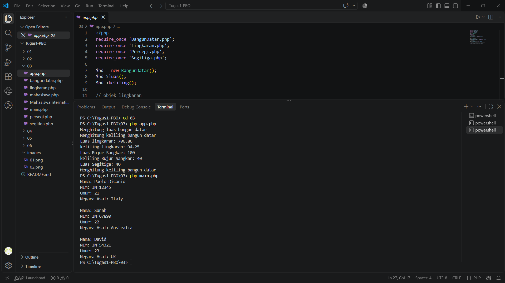
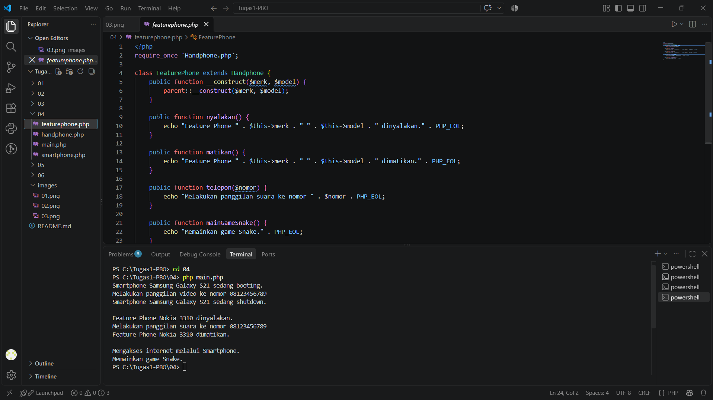

# Tugas 1 PBO - Convert Java ke PHP

## Materi 01 - Class

## Materi 02 - Constructor

## Materi 03 - Inheritance

## Materi 04 - Polymorphism

## Materi 05 - Asosiasikomposisi

## Materi 06 - Abstractinterface

