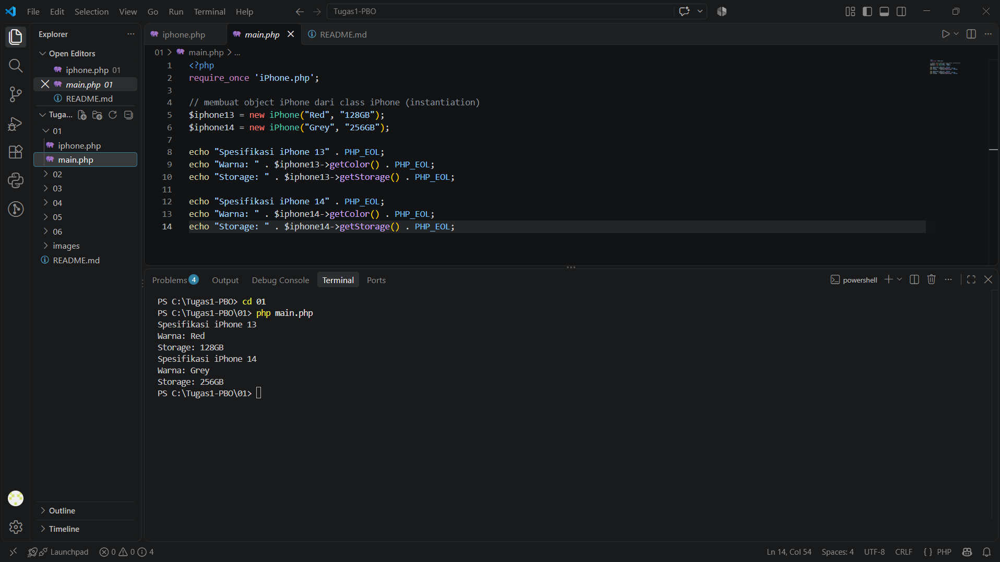
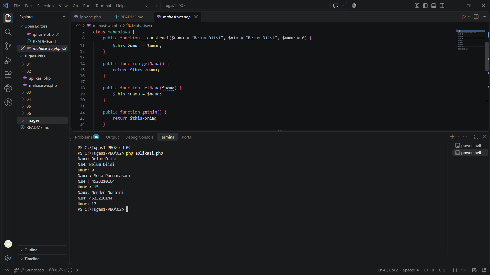
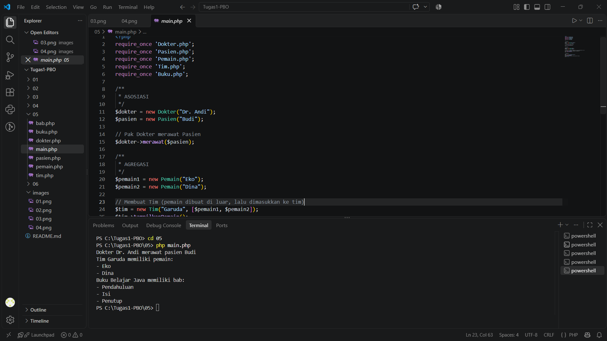
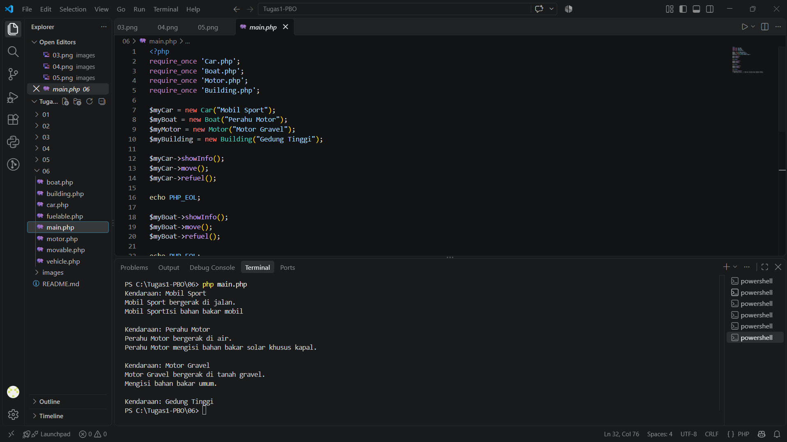

# Tugas 1 PBO - Convert Java ke PHP

## Cara Menjalankan

Pastikan PHP sudah terinstall, lalu jalankan lewat terminal:

```bash
cd 01
php main.php
```

---

## Materi 01 - Class

**File:** `iPhone.php`, `main.php`

**Penjelasan:**
Membuat class `iPhone` dengan properti `color` dan `storage`, lalu constructor untuk mengisi nilainya dan method `getColor()` serta `getStorage()` untuk mengambil nilainya. Di `main.php` dibuat dua objek (iPhone 13 dan iPhone 14) lalu spesifikasinya ditampilkan.

**Perbedaan Java ke PHP:** `this.color` menjadi `$this->color`, constructor menjadi `__construct()`, dan `System.out.println` menjadi `echo`.

**Output:**



---

## Materi 02 - Constructor

**File:** `Mahasiswa.php`, `aplikasi.php`

**Penjelasan:**
Class `Mahasiswa` memiliki atribut `nama`, `nim`, dan `umur` beserta getter dan setter. Di Java ada tiga constructor (constructor overloading). PHP tidak mendukung hal itu, jadi diganti dengan satu constructor yang memakai **parameter default**, sehingga objek bisa dibuat tanpa parameter, dengan 2 parameter, atau dengan 3 parameter.

**Output:**



---

## Materi 03 - Inheritance

**File:** `BangunDatar.php`, `Lingkaran.php`, `Persegi.php`, `Segitiga.php`, `app.php`, `Mahasiswa.php`, `MahasiswaInternational.php`, `main.php`

**Penjelasan:**
Inheritance (pewarisan) memungkinkan class anak memakai atribut dan method milik class induk.
- `Lingkaran`, `Persegi`, dan `Segitiga` mewarisi `BangunDatar` dengan keyword `extends`. Method `luas()` dan `keliling()` di-override sesuai rumus masing-masing. `Segitiga` tidak mendefinisikan `keliling()`, jadi yang terpanggil adalah milik parent.
- `MahasiswaInternational` mewarisi `Mahasiswa` dan menambah atribut `negaraAsal`. Constructor parent dipanggil dengan `parent::__construct()`, dan `tampilkanInfo()` di-override dengan `parent::tampilkanInfo()`.

**Output `app.php`:**


**Output `main.php`:**


---

## Materi 04 - Polymorphism

**File:** `Handphone.php`, `Smartphone.php`, `FeaturePhone.php`, `main.php`

**Penjelasan:**
Polymorphism berarti satu method yang sama bisa berperilaku berbeda tergantung objeknya. `Smartphone` dan `FeaturePhone` sama-sama mewarisi `Handphone` dan meng-override `nyalakan()`, `matikan()`, dan `telepon()`. Objek keduanya disimpan dalam satu array, lalu dipanggil lewat `foreach`. Method khusus (`aksesInternet()` dan `mainGameSnake()`) dipanggil setelah dicek dengan `instanceof`.

**Output:**


---

## Materi 05 - Asosiasi, Agregasi, dan Komposisi

**File:** `Dokter.php`, `Pasien.php`, `Pemain.php`, `Tim.php`, `Bab.php`, `Buku.php`, `main.php`

**Penjelasan:**
- **Asosiasi:** hubungan antar objek yang berdiri sendiri. `Dokter` merawat `Pasien`.
- **Agregasi:** hubungan "memiliki" yang longgar. `Pemain` dibuat di luar lalu dimasukkan ke `Tim`, sehingga pemain tetap ada walaupun tim dihapus.
- **Komposisi:** hubungan "memiliki" yang kuat. `Bab` dibuat di dalam `Buku`, sehingga jika buku dihapus, bab-nya ikut hilang.

**Output:**



---

## Materi 06 - Abstract Class dan Interface

**File:** `Vehicle.php`, `Movable.php`, `Fuelable.php`, `Car.php`, `Boat.php`, `Motor.php`, `Building.php`, `main.php`

**Penjelasan:**
- `Vehicle` adalah **abstract class** sebagai induk semua kendaraan, dengan method umum `showInfo()`.
- `Movable` dan `Fuelable` adalah **interface** yang berisi kontrak method `move()` dan `refuel()`.
- `Car`, `Boat`, dan `Motor` mewarisi `Vehicle` dan mengimplementasikan kedua interface. `Building` hanya mewarisi `Vehicle`, jadi tidak bisa `move()` maupun `refuel()`.

**Perbedaan Java ke PHP:** PHP tidak punya `default method` di interface seperti Java 8, jadi diganti dengan **trait** (`FuelableDefault`) yang dipakai oleh `Motor`.

**Output:**

